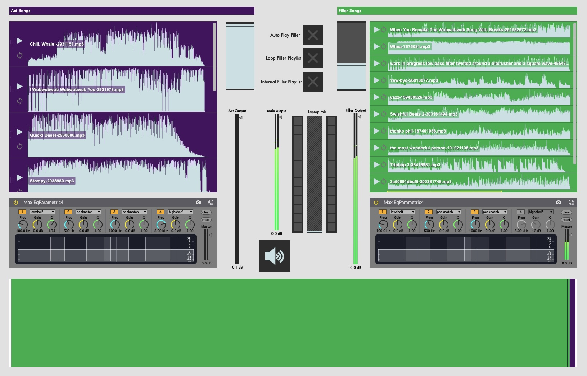

# GarterLoop

GarterLoop is a utility for running sound at variety shows made with Max/MSP.

:caution: It is very rough around the edges (and also the everywhere else) :caution:

## Background

Black Garter Revue is a lean troupe, with only a handful of people.
We often wear a bunch of hats in the middle of the chaos that is a show, anything we can do to cut down on thinking is good. Sometimes this is practicing your routine, sometimes this is making checklists, sometimes this is automating your audio software.
During a typical show a performer will run an act to a song, at the end of the act we fade over to some filler music, and the emcee distracts the crowd while stage techs (called kittens!) are doing cleanup and setup.
This cleanup and setup time is variable, sometimes you need to stall--a stuck zipper, a lost prop, a messy cleanup, an elaborate setup, that sort of thing.
I couldn't figure out how to do what I wanted in Live (I tried follow actions in session view and abusing loop brackets in arrangement view), so I did what anyone that can't figure out how to do a thing in Live does, fire up Max! GarterLoop was born.

## Features

- Automatically fade into filler music after an act so I don't have to be at the crossfader when someone's act finishes
- Loop between filler music tracks
- Act music always takes priority
- Big honking emergency stop button
- Big honking crossfader that's easy to hit
- Song trimming (i.e. long intros or long silent outros)
- EQ Control
- External audio support
- Laptop Mic in

## Future Plans

- Pull in lineup, show sound+tech notes next to the song in the playlist
- Percentage + time remaining in track displays
- Write Usage Section

## Usage

